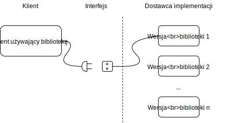

# Plan seminarium 11

1. Przypominamy szybko obliczanie wartości wielomianu na tablicach zaalokowanych dynamicznie
2. Przypominamy śledzenie wycieków pamięci za pomocą valgrind
3. Poprawiamy wydajność alokacji pamięci - nie realookujemy przy każdym dodaniu elementu, ale preallokujemy porcjami, za każdym razem dwa razy zwiększając rozmiar preallokowanej porcji,
    * potrzebujemy struktury `Wektor`, aby poprawić czytelność programu, ponieważ zwiększy nam się ilość informacji o wektorze,
    * w strukturze oprócz samych wartości i rozmiaru wektora (`n` - ilość liczb) zapamiętamy bieżący rozmiar zaalokowanej pamięci, która zawsze będzie większa lub równa zaalokowanej porcji pamięci,
    * utworzymy funkcję do inicjowania wektora (celem jest zamknięcie wielokrotnie używanych zadań w funkcje) - `vec_init`,
    * utworzymy funkcję do dodawania elementu do wektora (`vec_push`),
    * do wstawiania wartości na zadanej pozycji,
    * do usuwania ostatniego elementu (pop).
    Tym samym zaimplementujemy strukturę danych typu stos.
4. Przerabiamy program do liczenia wartości wielomianu za pomocą listy jednokierunkowej (skupiamy się na pokazaniu pisania funkcji do tworzenia, czyszczenia, itp.)
5. Spróbujmy teraz napisać (zaprojektować) jednolity interfejs do naszych zbiorów danych.
    * wyjaśnić pojęcie interfejsu (chcemy mieć łatwo wymienialny moduł implementujący zarządzanie wektorami)
6. ss


## Interfejs

Interfejs odnosi się do wielu elementów w inżynierii komputerowej i oprogramowania. Zasadniczo najważniejszymi definicjami są:

* interfejs komunikacyjny w ujęciu sprzętu komputerowego (porty USB, USB-C, micro USB, szeregowe, gniazda rozszerzeń na płytach głównych),
* interfejs użytkownika w ujęciu gotowego oprogramowania oznacza sposób komunikacji użytkownika z programem (metody przekazywania do programu instrukcji oraz odczytywania przez użytkownika wyników),
* interfejs API (ang. Application Programming Interface) - w dzisiejszych czasach często odnoszący się do programów sieciowych - zbiór adresów sieciowych i definicja komunikacji z nimi aby uzyskać jakiś efekt na serwerze internetowym (przykład użycia curl),
* interfejs programistyczny z punktu widzenia modułu oprogramowania - czyli zbiór typów danych zdefiniowanych przez jakąś bibliotekę i reguł posługiwania się funkcjami tej biblioteki; z punktu widzenia języka `C` takim interfejsem może być plik (lub ich zbiór) plik nagłówkowy.

Celem tworzenia interfejsu jest udostępnienie tzw. architektury modułowej (lub nawet komponentowej), która polega na tym, że moduły komunikują się ze sobą za pomocą określonych protokółów (procedur)  i wykorzystując specyficzne typy danych bez wnikania kto z nami rozmawia po drugiej stronie interfejsu.



Rys. 1. Idea interfejsu komunikacyjnego

W ramach seminarium postaramy się stworzyć jednolity interfejs do operowania na strukturach danych reprezentujących wektor. Stworzymy uniwersalną bibliotekę danych i będziemy wymieniać tylko wariant wewnętrznej implementacji. Struktura plików będzie następująca:

```bash
main.c                    # główny program sterujący
bibl.c bibl.h             # biblioteka wykonująca nasze operacje na wektorach
vec_array.c vec_array.h   # wariant implementacji wykorzystujący dynamicznie alokowaną tablicę liczby typu double
vec_list.c vec_list.h     # wariant implementacji wykorzystujący jednokierunkową listę dynamiczną
utils.h                   # wspólne narzędzia wykorzystywane w projekcie
```


Co dalej?
Interfejs użytkownika.
Komunikacja sieciowa - sterowanie urządzeniami. Jakiś Raspberry PI może?

Notatki:
Zainstalowałem pod Windowsem:

* [](https://sourceforge.net/projects/vcxsrv/files/latest/download)
* sudo apt install qt5-default
* python3 -m pip install pyqt5
